# 🚖 Fleet Taxi App – MERN Project

Fleet Taxi App is a **web-based fleet management and dispatch platform** designed for taxi companies.  
It provides **real-time insights**, role-based dashboards, trip and vehicle tracking, leave management, alerts, KPIs, reporting tools, **instant notifications**, and an **internal messaging system**.  
The application supports **Super Admin, Admin, and Driver roles** with dedicated features for each.

Built with the **MERN Stack** (**MongoDB**, **Express.js**, **React**, **Node.js**), Fleet Taxi App helps companies manage drivers, vehicles, trips, and company performance efficiently.

---

## 📑 Table of Contents

- [Features](#features)
- [Installation](#installation)
- [Configuration](#configuration)
- [Usage](#usage)
- [Project Structure](#project-structure)
- [Technologies Used](#technologies-used)
- [Screenshots](#screenshots)

---

## ✨ Features

### 🏆 Super Admin Features

- **📊 Dashboard** – Global KPIs and statistics
- **👥 User Management** – Manage all users in the system
- **🧑‍💼 Admin List** – View and manage company admins
- **✅ Approve Users** – Validate pending account requests
- **⚠ Alerts System** – Manage global alerts
- **📉 Alerts Analytics** – Track and analyze alert data
- **📅 Leave Management** – Approve/reject leave requests from all drivers
- **📑 Reports** – Generate and export operational reports
- **📜 Reports History** – View past reports
- **📈 KPIs** – Track overall company performance
- **🔔 Notifications System** – Receive real-time alerts for events, approvals, and messages
- **💬 Internal Messaging** – Chat with admins and drivers in real-time

### 🏢 Admin Features

- **📊 Dashboard** – Company-level KPIs
- **👥 Driver Management** – Add, update, and monitor drivers
- **🚖 Vehicle Management** – Manage company taxis
- **🛣 Trip Management** – Create, assign, and monitor trips
- **⚠ Alerts** – Generate and track company-specific alerts
- **📑 Reports** – Generate and export company reports
- **📉 Alerts Analytics** – View and analyze alert statistics
- **📅 Leave Requests** – Submit personal leave requests
- **🔔 Notifications System** – Get notified for trip updates, leave responses, and new messages
- **💬 Internal Messaging** – Communicate with super admin and drivers

### 🚗 Driver Features

- **📊 Dashboard** – Driver's personal KPIs
- **🛣 My Trips** – View and manage assigned trips
- **📅 My Leave Requests** – Submit leave requests
- **👤 My Profile** – View and update personal information
- **🔔 Notifications System** – Alerts for assigned trips, leave status, and messages
- **💬 Internal Messaging** – Chat with admins and super admin

---

## 📸 Screenshots

### Login

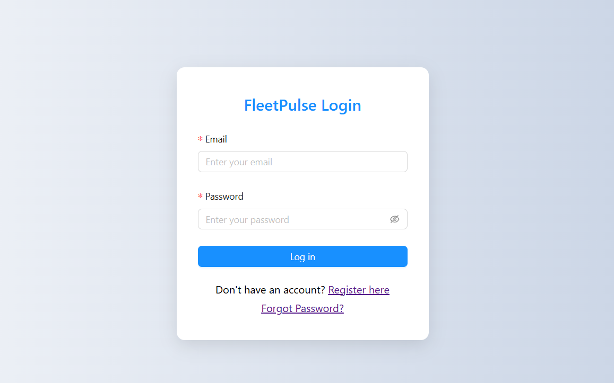

### Registre

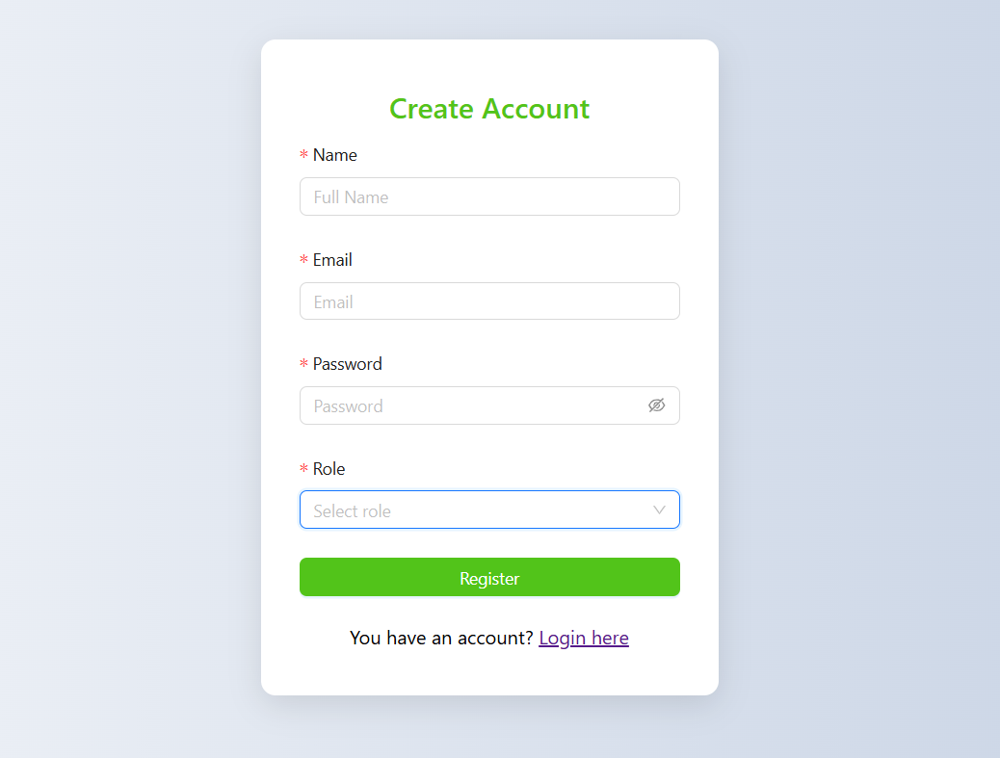

### Dashboard

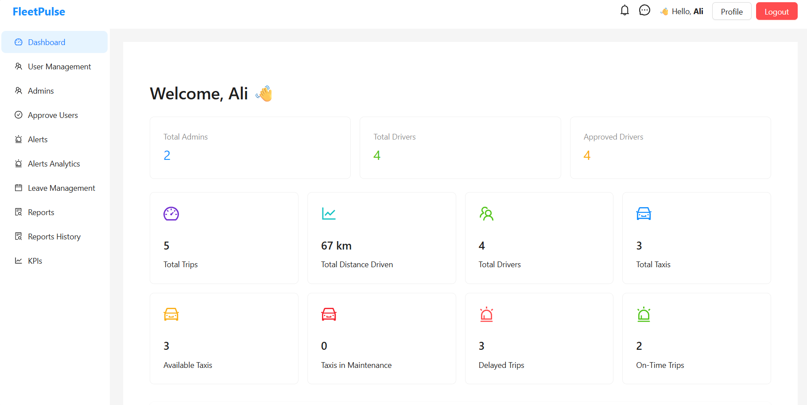

### User Management

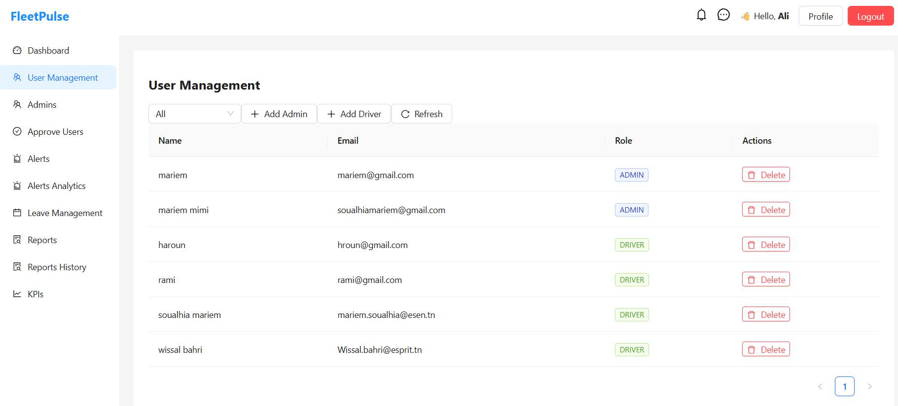

### Trip Management

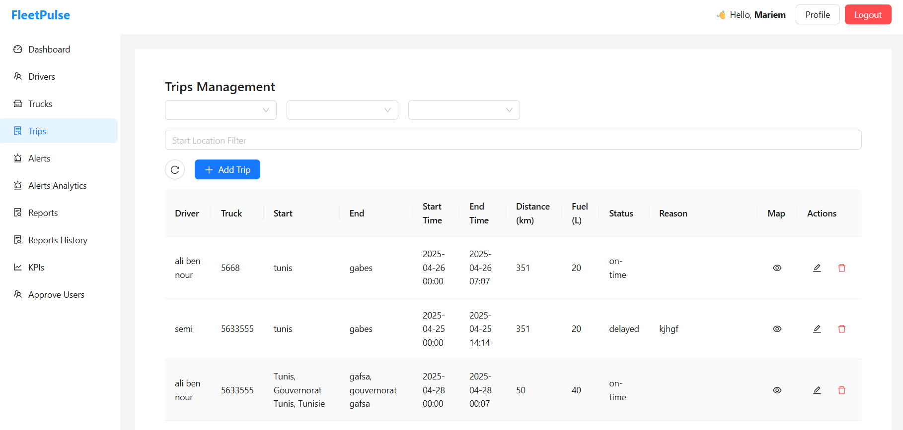

### Trip Map

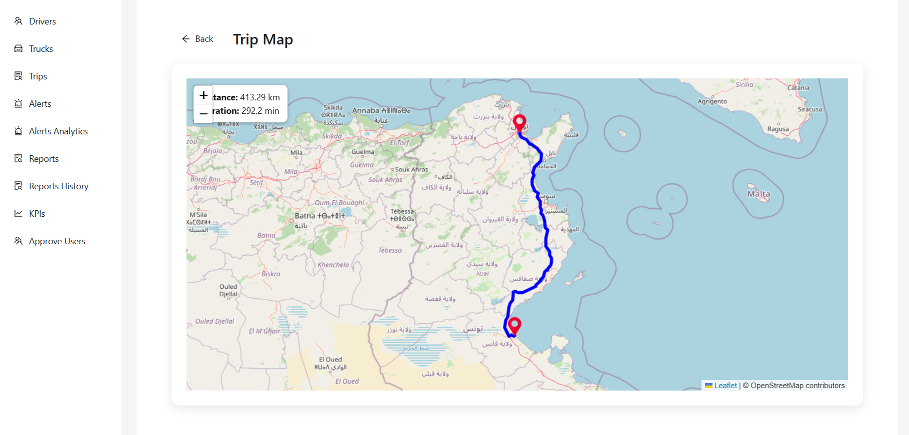

### Alerts

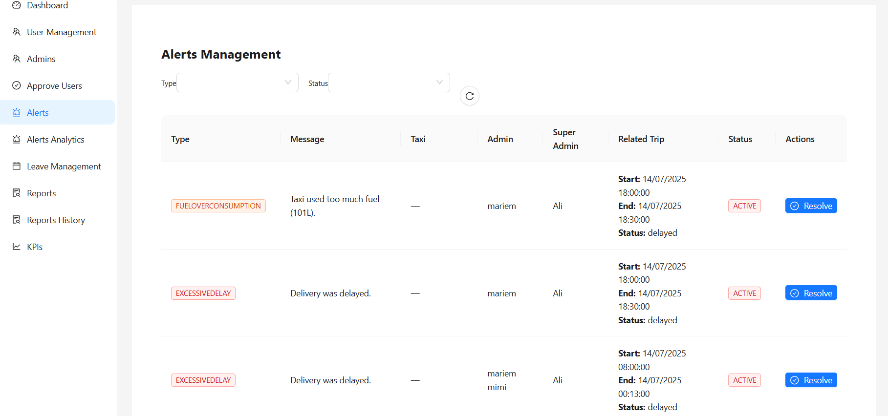

### Alerts Analytic

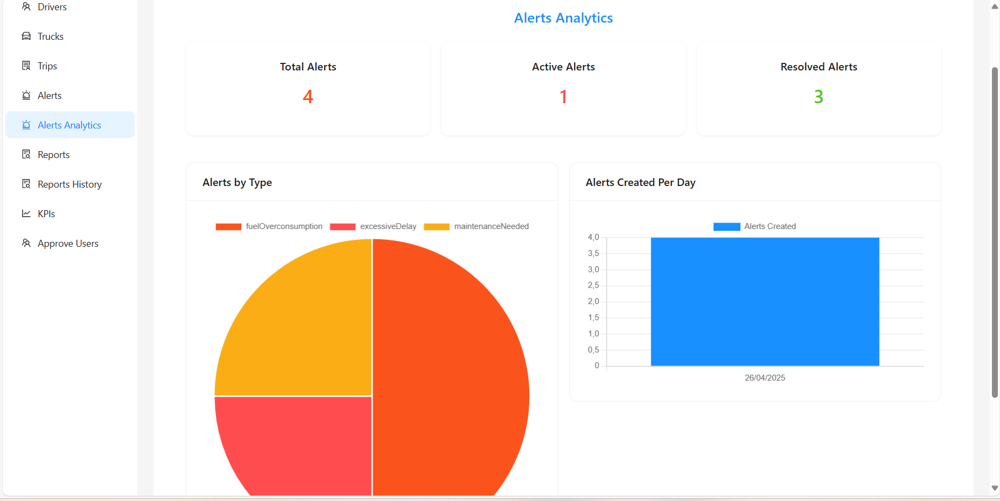

### KPI Page

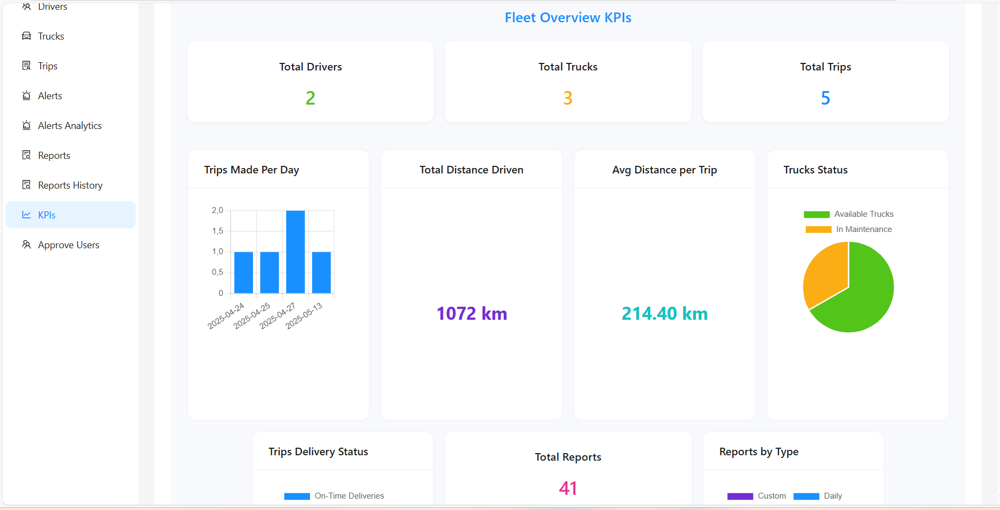

### Reports Management

## 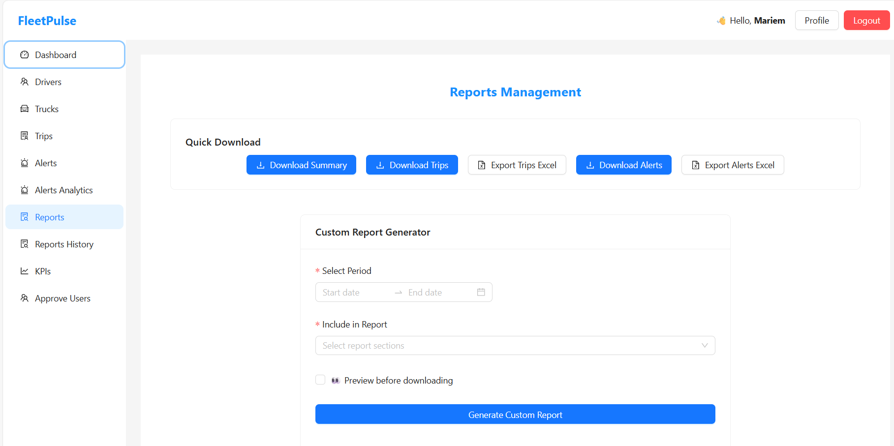

### Reports Management

## 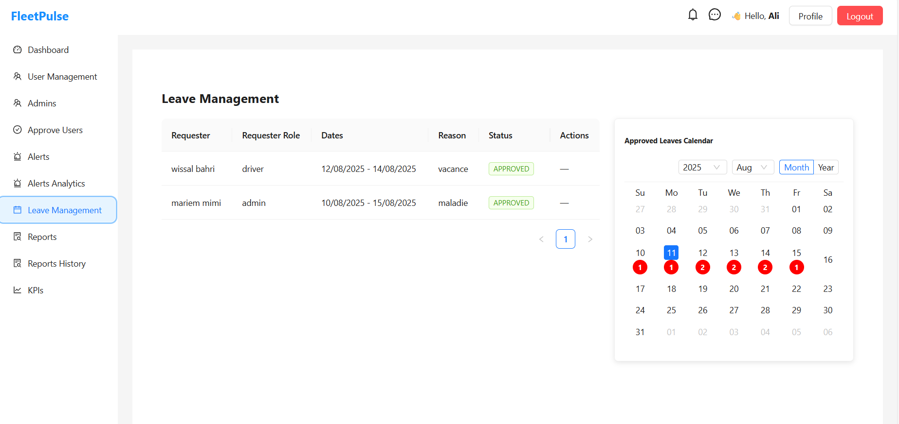

## ⚙ Installation

### Prerequisites

- **Node.js** (v14+ recommended)
- **MongoDB** (v4+)
- **npm** or **yarn**

### Steps

1. **Clone the repository**
   ```bash
   git clone https://github.com/yourusername/fleet-taxi-app.git
   cd fleet-taxi-app
   ```
2. Install dependencies

   Backend

   ```
   cd backend
   npm install
   ```

   Frontend

   ```
   cd ../frontend
   npm install
   ```

## ⚙ Configuration

Create a .env file inside the backend folder with the following variables:

```
MONGO_URI=mongodb://127.0.0.1:27017/fleetTaxi
PORT=5000
JWT_SECRET=123456789JTW
email=**********@gmail.com
password=**************************
```

### 🚀 Usage

1. Start the backend server

```
cd backend
npm strat
```

2. Start the frontend app

```
cd ../frontend
npm start

```

By default, the backend runs on http://localhost:5000 and the frontend on http://localhost:3000.
